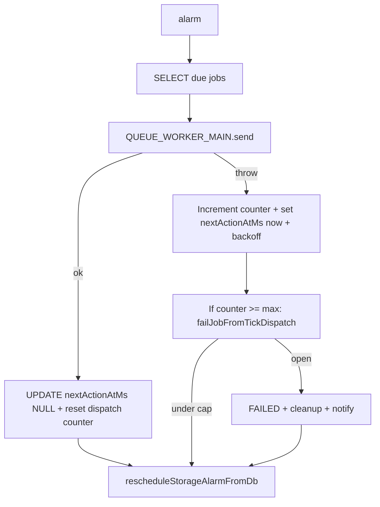

# Alarm tick dispatch: backoff (B) + circuit breaker (D)

## Context

The tight loop happens when [`alarm()`](src/modules/job-manager-do.ts) calls `QUEUE_WORKER_MAIN.send`, the `catch` path **leaves `nextActionAtMs` unchanged** (often already `<= now`), then [`rescheduleStorageAlarmFromDb()`](src/modules/job-manager-do.ts) calls `setAlarm` with that past-due time. **(B)** pushes the next wake into the future on send failure. **(D)** caps how long the job can sit in that retry loop before terminal failure.

## 1. Schema + types

- Add nullable-safe column on `job_state` via the existing migration loop in [`JobManagerDO.initIfNeeded`](src/modules/job-manager-do.ts) (same `ALTER TABLE ... try/catch` pattern as `consecutiveFailures`):
  - `tickDispatchConsecutiveFailures INTEGER NOT NULL DEFAULT 0`
- Extend [`JobStateRow`](src/lib/types/types.ts) with `tickDispatchConsecutiveFailures?: number` (read as `?? 0`).
- Extend [`ErrorKind`](src/lib/types/types.ts) with e.g. `queue_send_failed` (used when breaker trips; individual failures can keep logging the underlying error text).
- Extend [`ZipV2LifecycleEvent`](src/lib/types/types.ts) with e.g. `tick.dispatch.backoff` (optional, for B) and `tick.dispatch.breaker` (for D) so logs stay queryable.

## 2. Constants + env overrides

In [`src/lib/constants.ts`](src/lib/constants.ts), add defaults (tunable in plan implementation):

- `DEFAULT_TICK_DISPATCH_FAILURE_BACKOFF_MS` — e.g. `5000` (single knob for “do not reschedule alarm in the past”).
- `DEFAULT_MAX_TICK_DISPATCH_FAILURES` — e.g. `20` (~100s worst case at 5s spacing before terminal fail; avoids failing a job on a short blip).

In [`Env`](src/lib/types/types.ts) (optional but clearer than `(this.env as any)`), add optional string vars mirroring existing zip-v2 style:

- `ZIP_V2_TICK_DISPATCH_FAILURE_BACKOFF_MS`
- `ZIP_V2_MAX_TICK_DISPATCH_FAILURES`

Read with `toInt((this.env as any)...., DEFAULT)` in the alarm path only.

## 3. (B) Alarm `catch`: bump `nextActionAtMs` + increment counter

Inside the `catch` of the due-tick loop in [`alarm()`](src/modules/job-manager-do.ts) (~lines 155–162):

1. `const job = this.getJobRow(jobId)`; if missing, log and `continue`.
2. `const n = (job.tickDispatchConsecutiveFailures ?? 0) + 1`.
3. `const backoffMs = toInt(env.ZIP_V2_TICK_DISPATCH_FAILURE_BACKOFF_MS, DEFAULT_TICK_DISPATCH_FAILURE_BACKOFF_MS)`.
4. `const maxN = toInt(env.ZIP_V2_MAX_TICK_DISPATCH_FAILURES, DEFAULT_MAX_TICK_DISPATCH_FAILURES)`.
5. If `n >= maxN`, call new helper (step 4) instead of upserting backoff.
6. Else `this.upsertJob({ ...job, tickDispatchConsecutiveFailures: n, nextActionAtMs: nowMs() + backoffMs, updatedAtMs: nowMs() })` and log `tick.dispatch.backoff` with `jobId`, `n`, `maxN`, `nextActionAtMs`, and stringified error.

**Important:** do not rely on “keep old nextActionAtMs”; always set a **fresh** future timestamp in the sub-breaker path.

## 4. (D) Terminal path when counter hits cap

Add private `failJobFromTickDispatch(job: JobStateRow, err: unknown)` (or pass `jobId` + reload) that mirrors the outcome of [`failFinalizeJob`](src/modules/job-manager-do.ts) (~761–801):

- `status: "FAILED"`, `errorMessage` summarizing queue send exhaustion + last error snippet, `lastErrorKind: "queue_send_failed"`, `cleanupAtMs` via existing `getBundleCleanupTtlMs`, `nextActionAtMs: undefined`, `tickDispatchConsecutiveFailures: 0` (cosmetic for row until cleanup).
- `await this.persistTransferStatusNotify(..., { status: TransferStatus.READY_BUT_COMPRESSION_FAILED })` like finalize terminal.
- Log `tick.dispatch.breaker` with `jobId`, `transferId`, and error.

**Checkpoint:** unlike finalize, queue failure may happen when `getCheckpoint(jobId)` is missing; still terminal-fail the job (omit multipart abort if no `uploadId`; cleanup path already best-effort).

## 5. Reset counter on successful dispatch

Extend the success SQL in `alarm()` from:

`UPDATE job_state SET nextActionAtMs = NULL WHERE jobId = ?`

to also zero the counter:

`UPDATE job_state SET nextActionAtMs = NULL, tickDispatchConsecutiveFailures = 0 WHERE jobId = ?`

(Alternatively `upsertJob` after reload — raw SQL is simpler and avoids a second read.)

## 6. Wire `upsertJob` / `getJobRow` / `handleStart`

- [`getJobRow`](src/modules/job-manager-do.ts): add column to `SELECT` and map to `tickDispatchConsecutiveFailures: r.tickDispatchConsecutiveFailures ?? 0`.
- [`upsertJob`](src/modules/job-manager-do.ts): add column to `INSERT` column list, `VALUES`, and `ON CONFLICT DO UPDATE` (same pattern as `consecutiveFailures`).
- [`handleStart`](src/modules/job-manager-do.ts): set `tickDispatchConsecutiveFailures: 0` on the initial `upsertJob` payload so new rows are explicit.

All other call sites that spread `...job` / `...fresh` from `getJobRow` will carry the field automatically once read.

## 7. Tests / verification (lightweight)

If the repo has Vitest tests for `JobManagerDO`, add a focused test that mocks `QUEUE_WORKER_MAIN.send` to reject N times and asserts:

- after one failure, `nextActionAtMs` is strictly greater than `Date.now()` (with frozen clock if available);
- after `maxN` failures, job status is `FAILED` and counter/alarm behavior is stable.

If there is no existing harness, manual verification checklist in PR: force `send` throw in dev (temporary mock) and confirm logs show backoff then breaker.

## Files touched (expected)

| File | Change |
|------|--------|
| [`src/modules/job-manager-do.ts`](src/modules/job-manager-do.ts) | Migration, `alarm()` success/fail SQL + logic, `failJobFromTickDispatch`, `getJobRow`/`upsertJob`, `handleStart` |
| [`src/lib/types/types.ts`](src/lib/types/types.ts) | `JobStateRow`, `ErrorKind`, `ZipV2LifecycleEvent`, optional `Env` fields |
| [`src/lib/constants.ts`](src/lib/constants.ts) | New defaults |
| [`wrangler.toml`](wrangler.toml) | Optional commented vars for dev/prod tuning (only if you already document other `ZIP_V2_*` there; skip if unused) |

## Out of scope (optional follow-ups)

- **(A)** global `Math.max(nextAlarmAtMs, now + ε)` in `rescheduleStorageAlarmFromDb` — user asked B+D only; can stack later.
- Resetting `tickDispatchConsecutiveFailures` on successful **business** tick (HTTP `/tick`) — not required if counter is strictly “producer send failures”; successful `send` already resets.
